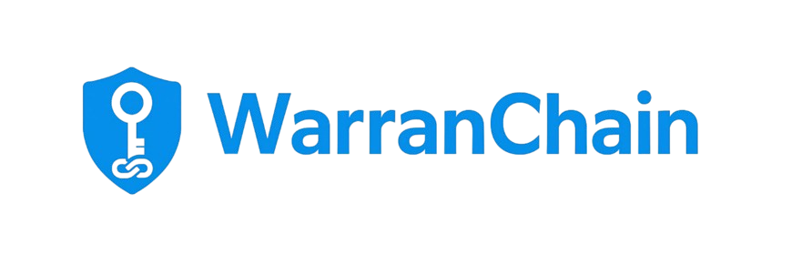

# WarranChain

A decentralized warranty management system built on the Sui blockchain, providing transparent and immutable warranty tracking for electronics and consumer goods.



## Overview

WarranChain revolutionizes warranty management by leveraging blockchain technology to create tamper-proof warranty records. Our platform enables manufacturers, sellers, and buyers to issue, transfer, and track warranties seamlessly while promoting sustainability through e-waste reduction and repair tracking.

## Key Features

### For Sellers & Manufacturers
- **NFT Warranty Issuance**: Issue warranty NFTs directly to customers
- **Sponsored Transactions**: Gasless minting using Enoki sponsored transactions
- **Product Management**: Organize warranties by product categories and models
- **Analytics Dashboard**: Track warranty performance and sustainability metrics
- **Bulk Operations**: Efficient batch warranty creation

### For Buyers & Consumers
- **Digital Warranty Ownership**: Own your warranties as transferable NFTs
- **Warranty Transfer**: Seamlessly transfer warranties when selling products
- **Repair Tracking**: Log repairs and maintenance history on-chain
- **Expiry Notifications**: Get reminded before warranty expiration
- **Sustainability Impact**: Track your contribution to e-waste reduction

### Blockchain Features
- **Sui Blockchain Integration**: Fast, low-cost transactions
- **zkLogin Authentication**: Secure Google OAuth integration
- **Smart Contract Security**: Immutable warranty logic
- **Real-time Updates**: Live warranty status and transfer tracking

## Architecture

```
WarranChain/
├── frontend/              # React.js Frontend Application
│   ├── src/
│   │   ├── components/    # Reusable UI components
│   │   ├── pages/         # Dashboard pages (Buyer/Seller)
│   │   ├── hooks/         # Custom React hooks
│   │   ├── services/      # API and blockchain services
│   │   └── utils/         # Utility functions
│   └── public/            # Static assets
├── backend/               # Node.js Backend Server
│   ├── services/          # Business logic services
│   ├── api/              # API endpoints
│   └── index.js          # Main server file
├── contracts/             # Move Smart Contracts
│   └── warranty_nft/     # Warranty NFT contract
│       ├── sources/      # Move source files
│       └── tests/        # Contract tests
└── scripts/              # Deployment and utility scripts
```

## Quick Start

### Prerequisites

- Node.js (v18+)
- npm or yarn
- Sui CLI
- Git

### Installation

1. **Clone the repository**
   ```bash
   git clone https://github.com/yongjing479/WarranChain.git
   cd WarranChain/WarranChain
   ```

2. **Install Frontend Dependencies**
   ```bash
   cd frontend
   npm install
   ```

3. **Install Backend Dependencies**
   ```bash
   cd ../backend
   npm install
   ```

4. **Environment Configuration**
   
   **Frontend (.env)**
   ```env
   REACT_APP_GOOGLE_CLIENT_ID=your_google_client_id
   REACT_APP_ENOKI_API_KEY=your_enoki_public_key
   REACT_APP_SUI_NETWORK=testnet
   REACT_APP_BACKEND_URL=http://localhost:3001
   ```

   **Backend (.env)**
   ```env
   ENOKI_API_KEY=your_enoki_private_key
   SUI_RPC_URL=https://fullnode.testnet.sui.io:443
   OAUTH_CLIENT_ID=your_google_client_id
   PACKAGE_ID=0xddf9437133e37cdc9278a3ffaf625eb54ff0cba8dc60797f8a84a0e09596f49d
   SUPABASE_URL=your_supabase_url
   SUPABASE_SERVICE_KEY=your_supabase_key
   ```

5. **Start the Backend Server**
   ```bash
   cd backend
   npm start
   ```

6. **Start the Frontend Application**
   ```bash
   cd frontend
   npm start
   ```

7. **Access the Application**
   - Frontend: http://localhost:3000
   - Backend API: http://localhost:3001

## Smart Contract Deployment

### Deploy to Sui Testnet

1. **Build the Contract**
   ```bash
   cd contracts/warranty_nft
   sui move build
   ```

2. **Deploy to Testnet**
   ```bash
   sui client publish --gas-budget 100000000
   ```

3. **Update Package ID**
   - Copy the package ID from deployment output
   - Update `PACKAGE_ID` in backend `.env`
   - Update `PACKAGE_ID` in frontend `contractConfig.js`

### Test NFT Minting

**Windows PowerShell:**
```powershell
cd contracts/warranty_nft
./mint_test_nft.ps1
```

**Linux/Mac:**
```bash
cd contracts/warranty_nft
chmod +x mint_test_nfts.sh
./mint_test_nfts.sh
```

## Authentication Flow

1. **Google OAuth**: Users sign in with Google
2. **zkLogin Integration**: Convert Google JWT to Sui address
3. **Sponsored Transactions**: Enoki handles gas fees for minting
4. **Wallet Creation**: Automatic wallet generation from email

## Usage Guide

### For Sellers

1. **Sign Up**: Create seller account with Google OAuth
2. **Issue Warranty**: Fill product details and buyer information
3. **Mint NFT**: System creates warranty NFT automatically
4. **Track Performance**: Monitor issued warranties on dashboard

### For Buyers

1. **Receive Warranty**: Get warranty NFT in your wallet
2. **View Details**: Check warranty status and expiry
3. **Transfer Ownership**: Transfer warranty when selling product
4. **Log Repairs**: Record maintenance and repair history

## Sustainability Features

- **E-waste Tracking**: Monitor prevented e-waste through repairs
- **Carbon Footprint**: Calculate CO2 reduction from extended product life
- **Repair Incentives**: Gamify repair tracking with sustainability scores
- **Local Business Support**: Connect with local repair services

## Development

### Running in Development Mode

**Backend with Hot Reload:**
```bash
cd backend
npm run dev
```

**Frontend with Hot Reload:**
```bash
cd frontend
npm start
```

### Project Structure

```
src/
├── components/
│   ├── Buyer/           # Buyer-specific components
│   ├── Seller/          # Seller-specific components
│   └── EnokiContext.js  # Authentication context
├── hooks/
│   └── useWarranties.js # Warranty management hook
├── pages/
│   ├── BuyerDashboard.js
│   ├── SellerDashboard.js
│   └── LoginPage.js
├── services/
│   ├── suiService.js    # Blockchain interactions
│   └── saltService.js   # zkLogin salt management
└── config/
    └── contractConfig.js # Smart contract configuration
```

## Testing

### Frontend Tests
```bash
cd frontend
npm test
```

### Backend Tests
```bash
cd backend
npm test
```

### Smart Contract Tests
```bash
cd contracts/warranty_nft
sui move test
```

## API Documentation

### Key Endpoints

- `POST /mint-nft-sponsored` - Mint warranty NFT with sponsorship
- `POST /get-address-from-email` - Get Sui address from email
- `POST /get-salt` - Get zkLogin salt for authentication
- `POST /sign-transaction` - Sign transactions with zkLogin

## Technology Stack

### Frontend
- **React.js** - UI framework
- **Mantine** - Component library
- **@mysten/sui.js** - Sui blockchain integration
- **@mysten/enoki** - Sponsored transactions
- **React Router** - Navigation

### Backend
- **Node.js** - Runtime environment
- **Express.js** - Web framework
- **@mysten/enoki** - Enoki SDK
- **Supabase** - Database and authentication
- **jsonwebtoken** - JWT handling

### Blockchain
- **Sui Blockchain** - Layer 1 blockchain
- **Move Language** - Smart contract language
- **zkLogin** - Privacy-preserving authentication

## Contributing

1. Fork the repository
2. Create feature branch (`git checkout -b feature/amazing-feature`)
3. Commit changes (`git commit -m 'Add amazing feature'`)
4. Push to branch (`git push origin feature/amazing-feature`)
5. Open Pull Request

## Troubleshooting

### Common Issues

**Backend Connection Refused**
- Ensure backend server is running on port 3001
- Check `.env` configuration
- Verify CORS settings

**Sponsored Transaction Failures**
- Check Enoki API key validity
- Verify package ID in contract config
- Ensure sufficient Enoki credits

**zkLogin Authentication Issues**
- Verify Google OAuth client ID
- Check redirect URI configuration
- Ensure proper JWT handling


**Built with love by the WarranChain Team**

*Transforming warranty management through blockchain technology*
